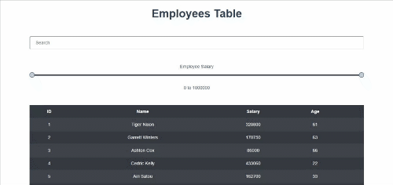
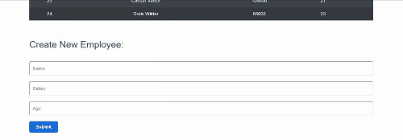

# VueJS Table with Search and Range Filters:

Link for the API used in this project: http://dummy.restapiexample.com/

 

## Filtering table with range picker and user search:

 
 

## Adding new employee to table:

 

- ID is generated by the API
- Data from form is not persistent
